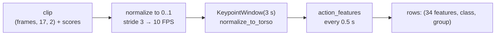

# How the recognizers are trained

The recognizers are random forests over hand-built features. No video is ever used: training reads
skeleton files that other people already computed, turns them into the same feature windows the robot
computes live, fits a scikit-learn forest, and exports it to a numpy file the robot can read.

A runnable, simplified version of the whole pipeline on synthetic data is in
`tmp_training_walkthrough.py` at the repo root (not versioned):

```bash
reachy_mini_env/bin/python tmp_training_walkthrough.py
```

## 1. The input: skeleton pickles, not videos

[`datasets/`](../datasets) holds three pickles published by OpenMMLab (PySkl). Each one is a list of
clips, and each clip is a dict:

| key | shape / value | meaning |
|---|---|---|
| `frame_dir` | `"S001C001P001R001A023"` | clip name; encodes the subject (`P001`) and action (`A023`) in NTU |
| `label` | `22` | class index in that dataset |
| `img_shape` | `(1080, 1920)` | frame height and width, to normalize pixels to 0..1 |
| `keypoint` | `(persons, frames, 17, 2)` | COCO-17 x, y in pixels, per frame |
| `keypoint_score` | `(persons, frames, 17)` | confidence per joint |

So a clip is already a sequence of skeletons at 30 FPS. HRNet, a pose estimator, produced them; we
never run it. Which dataset gives which class:

| dataset | classes we take | why |
|---|---|---|
| NTU RGB+D 60 | 22 = wave, 9 = clapping | studio, 40 subjects, 3 cameras |
| UCF101 | PushUps, BodyWeightSquats, JumpingJack | the only source with those exercises |
| HMDB51 | wave, pushup, clapping | movies; external test set only, never trained on |

Every other class in NTU and UCF101 becomes `none`. `--max-clips-per-class` caps how many clips of each
negative class are used so the negatives stay spread across many actions instead of dominated by one.

Code: `load_annotations`, `ntu_windows`, `ucf_windows`, `hmdb_windows` in
[`training/data.py`](../training/data.py).

## 2. Clip to windows: the same code the robot runs

A clip lasts a few seconds; the robot decides on a 3 s window. `clip_windows` in
[`training/data.py`](../training/data.py) does, for one clip:

1. **Pick one person**: the one with the highest mean keypoint score (HMDB51 has crowds).
2. **Normalize to the frame**: `x / width`, `y / height`, so the values look exactly like a pose backend's
   output on the robot (`(17, 3)` with x, y in 0..1 and a score).
3. **Resample 30 FPS to 10 FPS** (every 3rd frame). The robot camera gives ~10 FPS and features such
   as the reversal count depend on how densely the motion is sampled.
4. **Feed frames into a `KeypointWindow`** ([`core/motion/window.py`](../core/motion/window.py)), the
   same class the live monitor uses, with the same normalizer (`normalize_to_torso`) and the same extra
   channel (`trunk_height_parts`).
5. **Every 0.5 s, once the window spans at least 2 s**, call `action_features`
   ([`core/motion/features.py`](../core/motion/features.py)) and keep the resulting dict of 34 numbers.

One clip therefore yields several overlapping windows, each labelled with the clip's class and tagged
with the clip's *group* (the subject for NTU, the footage group for UCF101).



### Crop augmentation

The robot sits on a table and usually sees a waist-up person; the datasets always show the whole body.
`CROP_LEVELS` windows every clip three times: as published (`full`), with knees and ankles made
unconfident (`legs`), and with hips too (`waist`). Confidence is zeroed *before* windowing, so the
normalizer and the features see a genuinely cropped skeleton, as they would live. The cropped copies are
kept apart by a `crop` tag so the report can score each regime separately.

## 3. Rows to arrays

`to_arrays` in [`training/train_actions.py`](../training/train_actions.py) turns the rows into:

- `X`: `(n_windows, 34)` float32, columns in `ACTION_FEATURE_NAMES` order;
- `y`: `(n_windows,)` class names (`none`, `wave`, ...);
- `groups`: `(n_windows,)` the person or footage group of each window.

That is all a scikit-learn classifier needs.

## 4. Evaluation grouped by person

Windows from one clip overlap almost entirely, and one subject appears in many clips. A random
train/test split would put near-copies of the training windows in the test set and report a score we
would never see live. So:

- `GroupKFold(n_splits=5)` splits **by group**: every person is either entirely in the training half
  or entirely in the test half of a fold.
- For each fold, a forest is fitted on the training half and `predict_proba` is taken on the test
  half. After five folds every window has exactly one **out-of-fold** probability vector.
- Only the `full` windows plus `--crop-fraction` (0.25) of the cropped ones enter a fold's training
  half; the test half always keeps all windows, so every setting is scored on the same data.

All reported precision / recall / F1 numbers come from these out-of-fold predictions.

## 5. Decision floors

A forest's `predict_proba` gives six probabilities per window. Taking the argmax alone would turn every
uncertain window into some action. Instead, `tune_floors` sweeps a confidence floor (0.05 to 0.90) per
class on the out-of-fold probabilities and keeps the value that maximizes that class's F1. At inference,
the winning class must clear its own floor, otherwise the answer is `none`. `none` itself has no floor.

## 6. Fit on everything and export

After the evaluation, one final `RandomForestClassifier(n_estimators=300,
class_weight="balanced_subsample", n_jobs=-1)` is fitted on all trainable windows.
`export_forest` ([`core/motion/forest.py`](../core/motion/forest.py)) then writes, per tree, the arrays
scikit-learn keeps in `estimator.tree_`:

| array | meaning |
|---|---|
| `left_i`, `right_i` | child node index (−1 at a leaf) |
| `feature_i` | which of the 34 features the node compares |
| `threshold_i` | the split value |
| `proba_i` | class distribution at every node |

plus `feature_names`, `window_s`, `classes` and the `thresholds` (floors). The robot's `NumpyForest`
walks each tree (`left if x[feature] <= threshold else right`), averages the leaf distributions and
applies the floors: exactly `predict_proba`, with no scikit-learn installed.

## 7. The wave model, the same recipe

[`training/train_wave.py`](../training/train_wave.py) is the binary version: NTU class 22 against every
other class, 1.5 s windows normalized to the shoulders, the 9 features of `window_features`, a
100-tree forest of depth 6, `GroupKFold` by subject, and one decision threshold tuned for F1 on the
out-of-fold probabilities (0.75 in the shipped model). HMDB51 and our own recordings
([`training/data/wave/`](../training/data/wave), made with [`training/record.py`](../training/record.py))
are scored as external test sets.

## 8. Reading the report

`train_actions` prints, in order: window and group counts per class, the pooled out-of-fold table, the
floors, the confusion matrix, per-fold tables (the spread across folds is the honest number for a thin
class such as push-ups), per crop regime, per source dataset, feature importances, and the external
sets. What those numbers mean for a demo: [action-recognition.md](action-recognition.md).
