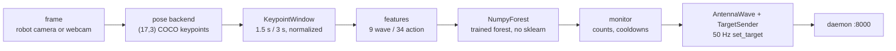

# Code walkthrough

How the prototype goes from a camera frame to an antenna gesture, file by file. Shorter than the
explanation session; every heading links to the code it describes.

## 0. The pipeline



| Directory | Runs where | Contents |
|---|---|---|
| [`core/`](core) | Mac **and** robot | pose backends, `core/motion/`, vision, tracking, tracked `.npz` models |
| [`robot/`](robot) | the physical robot | connection, preflight, apps, deployment |
| [`sim/`](sim) | Mac only | MuJoCo simulation driven by the webcam |
| [`training/`](training) | Mac only, needs scikit-learn | recording, dataset loaders, the two trainers |

`core/` imports nothing from the other three; [`robot/deploy.sh`](robot/deploy.sh) ships `core/` and
`robot/` as whole directories, so scikit-learn never reaches the robot.

## 1. Talking to the robot

The daemon on the robot serves a REST API on port 8000 (Swagger at `http://<host>:8000/docs`) and the
WebSocket channel the Python SDK uses. We use both:

- [`robot/preflight.py`](robot/preflight.py), stdlib only: reads and fixes the robot state over REST
  (daemon status, motors, sleep pose, camera acquired, tracker frames). The daemon boots with
  `--no-wake-up-on-start`, so this runs before anything that moves the robot.
- [`robot/connect.py`](robot/connect.py): preflight + `ReachyMini(...)` as a context manager for the
  small apps ([`robot/apps/antennas.py`](robot/apps/antennas.py),
  [`explore.py`](robot/apps/explore.py), [`look_at_click.py`](robot/apps/look_at_click.py)).
- [`robot/apps/common.py`](robot/apps/common.py): the recognition loop shared by
  [`wave_antennas.py`](robot/apps/wave_antennas.py) and
  [`action_recognition.py`](robot/apps/action_recognition.py). Frames come from
  `mini.media.get_frame()`, targets go out through `set_target` (non-blocking, one target) while
  `goto_target` (blocking, resets body yaw) is used only for the neutral pose at start and exit.
- [`core/motion/antennas.py`](core/motion/antennas.py): `TargetSender` runs its own 50 Hz thread
  because the vision loop on the robot is ~9 FPS, too slow to sample an antenna sine smoothly.

Deployment: [`robot/deploy.sh`](robot/deploy.sh) creates `~/wave_env` on the robot and copies the
code to `~/wave_app`; [`robot/demo.sh`](robot/demo.sh) chains sync, preflight and the wave app.
Details in [robot.md](docs/robot.md) and [demo.md](docs/demo.md).

## 2. Training the recognizers

We train on **published COCO-17 skeletons** (HRNet, OpenMMLab PySkl pickles) of three public datasets,
never on video. Provenance and licences: [`datasets/SOURCES.md`](datasets/SOURCES.md).

| Dataset | Role | Classes taken |
|---|---|---|
| NTU RGB+D 60 | train, held-out folds by subject | wave, clapping |
| UCF101 | train, held-out folds by footage group | pushup, squat, jumping_jacks |
| HMDB51 | external test only | wave, pushup, clapping |

- [`training/data.py`](training/data.py): loads the pickles, picks the most confident person,
  resamples 30 FPS to the robot's 10 FPS, applies the crop augmentation (legs / waist made unconfident,
  because the robot on a table sees a waist-up person) and feeds frames into the **same**
  `KeypointWindow` and feature functions the robot runs. Also reads our own recorded sessions from
  [`training/record.py`](training/record.py), used as an external test set.
- [`training/train_actions.py`](training/train_actions.py): `GroupKFold` by person, out-of-fold
  probabilities, one confidence floor tuned per class, fit on everything, export.
- [`training/train_wave.py`](training/train_wave.py): same idea, binary, one tuned threshold.

```bash
tools/download_datasets.sh
reachy_mini_env/bin/python -m training.train_actions --ntu datasets/ntu60_hrnet.pkl \
    --ucf datasets/ucf101_hrnet.pkl --hmdb datasets/hmdb51_2d.pkl --crop-fraction 0.25
```

Measured results and what is honestly demonstrable: [action-recognition.md](docs/action-recognition.md).

## 3. Pose estimation

COCO-17 is the 17-keypoint skeleton of the COCO dataset (nose, eyes, ears, shoulders, elbows, wrists,
hips, knees, ankles); the index constants live in
[`core/pose_backends/__init__.py`](core/pose_backends/__init__.py). Every backend returns a
`PoseResult` with a `(17, 3)` array of x, y normalized to the frame and a score, or `None`.

- [`core/pose_backends/blazepose.py`](core/pose_backends/blazepose.py): MediaPipe Pose Landmarker
  (`tasks` API, VIDEO mode, CPU). BlazePose gives 33 landmarks; `BLAZEPOSE_TO_COCO` maps them to the
  17 by index, with `visibility` as the score. Mac only: the aarch64 mediapipe binaries need AES
  instructions the robot's CPU lacks.
- [`core/pose_backends/movenet.py`](core/pose_backends/movenet.py): MoveNet Lightning, fp32 on
  onnxruntime or int8 on LiteRT (`movenet-tflite`, the robot default, ~34 ms/frame).
- [`core/pose_backends/vitpose.py`](core/pose_backends/vitpose.py): person detector + ViTPose-S,
  Mac only, for comparison.

Model comparison: [pose-models.md](docs/pose-models.md).

## 4. From a pose per frame to a decision per window

- [`core/motion/window.py`](core/motion/window.py): `KeypointWindow` keeps the last 1.5 s (wave) or
  3 s (actions) of skeletons. Each frame is normalized first: x scaled by the frame aspect ratio, origin
  on the shoulder midpoint, unit = shoulder width (`normalize_to_shoulders`) or torso length
  (`normalize_to_torso`). Rejected frames become NaN rows. `trunk_height_parts` is an extra channel
  that keeps the vertical position normalization deletes, the only squat signal that survives waist-up.
- [`core/motion/wave.py`](core/motion/wave.py): `WaveMonitor` runs the rules and the forest every
  0.1 s and triggers one `AntennaWave` per detected wave.
- [`core/motion/actions.py`](core/motion/actions.py): `ActionMonitor` classifies every frame,
  counts a repeat only once the window has refilled, and answers with one antenna signature per class.
  Its aspect ratio has no default: build it from the first real frame.

## 5. Features

All in [`core/motion/features.py`](core/motion/features.py), computed over score-masked frames and
joints; unmeasurable features report 0.0 and the `*_valid_frac` features say whether a limb was seen.

- `window_features` (wave, 9): for the most active wrist, fraction above the shoulder, mean height,
  x/y amplitude (10th to 90th percentile), reversals and reversal rate, mean speed, elbow-below fraction,
  valid fraction. The rules in `wave.py` use three of them.
- `action_features` (actions, 34): torso angle and bounding-box aspect, vertical oscillation of
  shoulders / hips / wrists / trunk height, knee and elbow angles (mean, min, amplitude), ankle
  separation, wrists above head, wrist distance, the wave subset, and the visibility fractions.

Training and inference call the same functions; the `.npz` stores the feature order and refuses to load
if it differs.

## 6. The random forest

[`core/motion/forest.py`](core/motion/forest.py).

| | Wave | Actions |
|---|---|---|
| scikit-learn model | 100 trees, depth 6, balanced | 300 trees, balanced_subsample |
| decision | P(wave) ≥ stored threshold | argmax, `none` below the class floor |
| shipped file | [`core/models/wave_classifier_ntu.npz`](core/models) | [`core/models/action_classifier.npz`](core/models) |

`export_forest` writes each fitted tree as flat arrays (`left`, `right`, `feature`, `threshold`,
`proba`). `NumpyForest` walks them from the root and averages the leaf distributions, which is exactly
`predict_proba`, without scikit-learn on the robot (~33 ms cheaper per sample on the CM4, no pickle
version coupling).

## 7. How we verify

No unit tests, by decision. Replay the recorded sessions in
[`training/data/wave/`](training/data/wave) through the monitors and compare, run
[`sim/body_tracking.py`](sim/body_tracking.py) on the webcam, or run the app on the robot.
